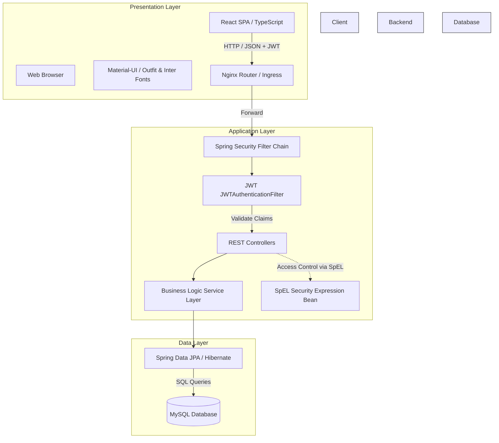
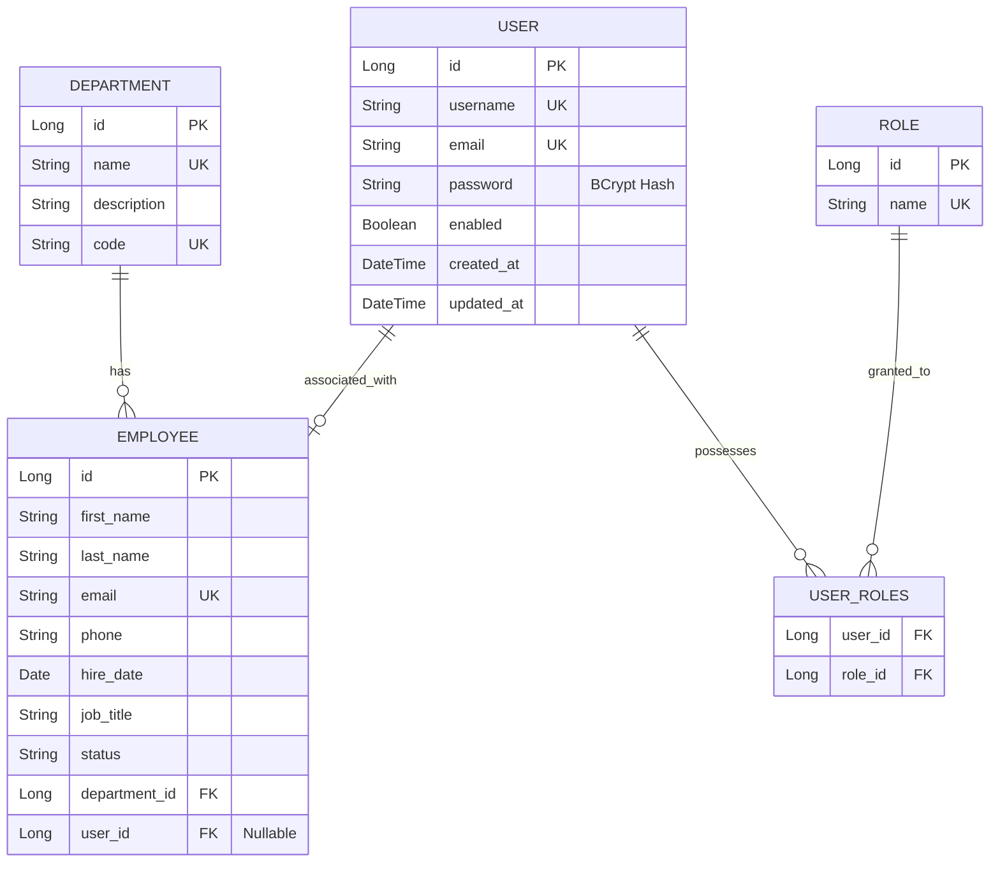

# Employee Management System (EMS)

A comprehensive, full-stack enterprise Employee Management System built using **Spring Boot 3** (Application Layer), **React 19 + TypeScript + Material-UI (MUI) v9** (Presentation Layer), and **MySQL 8** (Data Layer). The system features secure state management via stateless JWTs, Role-Based Access Control (RBAC), and is styled with a premium **Minimalism Design Theme**.

---

## Key Features

* **Complete Employee Lifecycle**: Full CRUD operations for employee files with input validation (e.g. hire date limits, email uniqueness).
* **Granular Role-Based Access (RBAC)**: Backend-enforced route authorization with four pre-seeded business roles: `ROLE_ADMIN`, `ROLE_HR`, `ROLE_MANAGER`, and `ROLE_EMPLOYEE`.
* **Integrated User Provisioning**: Admins can bind credential logins directly to existing employee accounts from the details view, or manage users via a dedicated console.
* **Interactive Dashboard**: Direct metrics visualising department size distribution, active/on-leave counts, and system metrics.
* **Robust Docker Orchestration**: Spin up backend, frontend, and database nodes locally with a single command.

---

## System Architecture

The architecture is split into three decoupled tiers orchestrated via Docker:



For a detailed walkthrough of request lifecycles, authentication flows, and SpEL authorization filters, refer to the [System Architecture Guide](file:///a:/My%20project/employee-management-system/docs/architecture.md).

---

## API Documentation Summary

All backend requests target the `/api` prefix and require a JWT token in the request headers:
```http
Authorization: Bearer <JWT_TOKEN>
```

### Core API Endpoints

| HTTP Method | Route | Description | Security Level |
| :--- | :--- | :--- | :--- |
| **POST** | `/api/auth/login` | Log in and receive JWT | *Public* |
| **POST** | `/api/auth/register` | Register new user account | `ROLE_ADMIN` |
| **GET** | `/api/auth/users` | List system users (paginated) | `ROLE_ADMIN` |
| **POST** | `/api/employees` | Add a new employee profile | `ROLE_ADMIN`, `ROLE_HR` |
| **GET** | `/api/employees/{id}` | Retrieve employee by ID | `@sec.isOwnerOrPrivileged(#id)` |
| **POST** | `/api/employees/{id}/account` | Provision a user account to employee | `ROLE_ADMIN` |
| **GET** | `/api/dashboard/stats` | Retrieve KPI metrics summaries | `ROLE_ADMIN`, `ROLE_HR`, `ROLE_MANAGER` |

For a complete reference including sample request payloads, query parameters, response structures, and client route component mapping, read the [API Reference Guide](file:///a:/My%20project/employee-management-system/docs/api.md).

---

## Database Diagram

The relationship schema between Employees, Departments, Users, and Roles:



---

## Installation Guide

### Running via Docker (Recommended)
1. Ensure [Docker Desktop](https://www.docker.com/) is installed and running.
2. Spin up the environment cluster:
   ```bash
   docker compose up -d --build
   ```
3. Open [http://localhost](http://localhost) on your web browser to access the frontend portal.
4. Log in using the default admin account:
   * **Username**: `admin`
   * **Password**: `admin123`

### Running Locally (Manual Setup)
1. **Database Setup**: Install MySQL 8 and create a database named `employee_db`. Update username/password in `src/main/resources/application.properties`.
2. **Run Backend**:
   ```bash
   mvn spring-boot:run
   ```
3. **Run Frontend**:
   ```bash
   cd frontend
   npm install
   npm run dev
   ```

---

## Future Enhancements

The roadmap details key operational expansions scheduled for upcoming updates:
* **Leave Management module**: Dynamic workflows allowing employees to request leave and managers to approve/deny them.
* **Audit Trail logs**: Database logs capturing all HR actions, user updates, and profile edits for auditing compliance.
* **SSO & OAuth2 integration**: Third-party login provider configurations (Okta, Microsoft AD, Google Workspace).
* **Document Management module**: Secure cloud storage mappings (AWS S3) for storing contracts, certificates, and payroll files.
