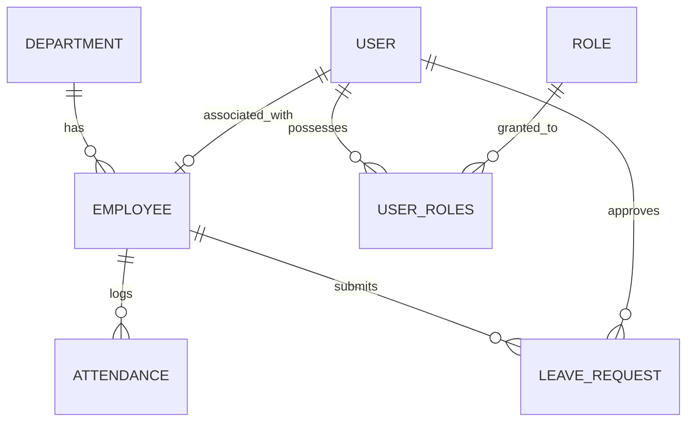

# Enterprise Employee Management System (EMS)

A premium, full-stack Enterprise Employee Management System designed for modern HR, department collaboration, and automated workforce orchestration. Built on a modular service architecture using **Spring Boot 3** (Application Layer), **React 19 + TypeScript + Material-UI (MUI) v9** (Presentation Layer), and **MySQL 8** (Data Layer), it offers enterprise-grade scalability, JWT-based security, Role-Based Access Control (RBAC), and adaptive dashboards styled with an ultra-premium **Minimalist Slate Design Theme**.

---

## Project Description

The EMS is a centralized administrative tool built to coordinate company staff files, streamline organizational hierarchies, and automate day-to-day work metrics. It integrates a secure profile registry with two major operational modules:
1. **Attendance & Shift Management**: Real-time Check In/Out clocking, active working hours calculation, grace periods, and a daily background scheduler to finalize logs.
2. **Leave & WFH Approvals**: Outage request submissions (Sick Leave, Casual Leave, Short Permissions, and Remote Work) governed by a strict hierarchical approval engine.


---

## Key Features

### Employee & Profile Lifecycle
* **Staff Catalog**: Full CRUD employee registry with database-enforced integrity checks (email uniqueness, phone formatting, hire date limits).
* **Account Provisioning**: Bind credentials directly to existing employee files from the details view, enabling seamless transitions from profile creation to user access.

### Role-Based Access Control (RBAC) & Security
* **Stateless Authentications**: Secured via stateless, cryptographically signed JSON Web Tokens (JWT) passed in the `Authorization` header.
* **Granular Filters**: Backend controller endpoints and frontend views are restricted using Spring Method Security Expressions (`hasRole`, `hasAnyRole`) matching four pre-seeded business roles:
  * `ROLE_ADMIN`: Full system controls, global attendance reporting, shift timing adjustments, user account configurations, and manager leave approvals.
  * `ROLE_HR`: Catalog curation and global staff details visibility.
  * `ROLE_MANAGER`: Departmental insights, team presence rosters, employee leave logs, and team leave approvals.
  * `ROLE_EMPLOYEE`: Self-service view, daily check-in clocking, personal attendance log, and personal leave requests.

### Attendance & Working Hours
* **Daily Attendance Clock**: Personal dashboard featuring a circular ticking session timer, Check In/Out buttons, and monthly summary widgets (Days Present, Late Entries, Absent, Remote, WFH, and Approved Leaves).
* **Timezone Calibrated**: Backend JVM defaulted to `Asia/Kolkata` (UTC+5:30) to eliminate timezone offset display bugs and align check-in/out records to the user's local day.
* **Auto-Finalization Scheduler**: A background Spring Cron Job runs nightly at 11:59 PM to evaluate all active employee profiles, calculate shift deviations, auto-clock out missing logs, and write status tags (`PRESENT`, `LATE`, `ON_LEAVE`, `WFH`, `WEEKEND`, `HOLIDAY`, `ABSENT`).

### Hierarchical Leave & WFH Workflow
* **Submit Drawer**: Dynamic request drawer supporting WFH, Casual, Sick, and Short Permission requests.
* **Approval Hierarchies**:
  * **Employee leaves** can ONLY be approved/rejected by their department manager (Admins are restricted).
  * **Manager leaves** can ONLY be approved/rejected by the system Administrator.
  * **Admin leaves** are automatically auto-approved upon submission.
* **History Logs**: Clean logs table displaying status tags (`PENDING`, `APPROVED`, `REJECTED`) and approving managers. Managers view department-level logs; Admins enjoy global visibility.

---

## Technology Stack

* **Frontend**:
  * **Core**: React 19 + TypeScript + Vite
  * **Styling**: Material-UI (MUI) v9 + Emotion (Vanilla theme tokens, no CSS frameworks)
  * **Routing & State**: React Router Dom v6 + Axios Http client + Context API
* **Backend**:
  * **Core**: Spring Boot 3.4 + Java 21 + Maven
  * **Security**: Spring Security + JWT + BCrypt Password Encoder
  * **Persistence**: Spring Data JPA + Hibernate (ORM)
* **Database**: MySQL 8.0 Community Edition
* **Deployment & Containerization**: Docker + Docker Compose + Ingress Router

---

## Installation Guide

### Prerequisites
* [Docker Desktop](https://www.docker.com/) (Recommended) OR Local JDK 21 + Node.js 20 + MySQL 8 environment.

### Running via Docker (Recommended)
1. Clone the repository and navigate to the project directory:
   ```bash
   cd employee-management-system
   ```
2. Build and run the containers:
   ```bash
   docker compose up -d --build
   ```
3. Open [http://localhost](http://localhost) on your web browser to access the frontend portal.
4. Log in using the pre-seeded admin credentials:
   * **Username**: `admin`
   * **Password**: `admin123`

---

## Running Locally (Manual Development Setup)

### Backend Service (Spring Boot)
1. Ensure a local MySQL database named `ems_db` is running.
2. Update the credentials inside `src/main/resources/application.properties` (or set environment variables `SPRING_DATASOURCE_USERNAME` and `SPRING_DATASOURCE_PASSWORD`).
3. Compile and launch the Spring Boot application:
   ```bash
   mvn spring-boot:run
   ```
4. The API server will boot on port `8080` ([http://localhost:8080](http://localhost:8080)).

### Frontend Service (React + Vite)
1. Navigate into the frontend subdirectory:
   ```bash
   cd frontend
   ```
2. Install npm packages:
   ```bash
   npm install
   ```
3. Run the development dev-server:
   ```bash
   npm run dev
   ```
4. Access the web app locally on port `5173` ([http://localhost:5173](http://localhost:5173)).

---

## API Overview

All requests require authorization using a stateless JWT:
`Authorization: Bearer <JWT_TOKEN>`

### Auth & User Endpoints
* `POST /api/auth/login` - Public login, returns JWT token + user details.
* `POST /api/auth/register` - Register a new system user (`ROLE_ADMIN` only).
* `GET /api/auth/users` - Paginated user listings for audit check (`ROLE_ADMIN` only).

### Employee Registry Endpoints
* `GET /api/employees` - Search and fetch employees list (`ROLE_ADMIN`, `ROLE_HR`, `ROLE_MANAGER`).
* `GET /api/employees/{id}` - Fetch employee details. Checked via custom SpEL logic (`@sec.isOwnerOrPrivileged(#id)`).
* `POST /api/employees` - Create employee profile (`ROLE_ADMIN`, `ROLE_HR`).
* `PUT /api/employees/{id}` - Edit employee profile (`ROLE_ADMIN`, `ROLE_HR`).
* `POST /api/employees/{id}/account` - Bind user credentials account to profile (`ROLE_ADMIN` only).

### Attendance & Timer Endpoints
* `POST /api/attendance/clock-in` - Perform Daily Check In.
* `POST /api/attendance/clock-out` - Perform Daily Check Out.
* `GET /api/attendance/today` - Retrieve current day clock status (returns null if not checked in).
* `GET /api/attendance/summary` - Fetch monthly counts (Present, Late, Absent, WFH, leaves).
* `GET /api/attendance/history` - Query personal historical attendance list (date-range query).
* `GET /api/attendance/team/today` - Department team presence roster today (`ROLE_MANAGER`, `ROLE_ADMIN`).
* `GET /api/attendance/team/history` - Department team attendance logs range (`ROLE_MANAGER`, `ROLE_ADMIN`).
* `GET /api/attendance/team/summary` - Status metrics count for the team (`ROLE_MANAGER`, `ROLE_ADMIN`).
* `GET /api/attendance-policy` - Retrieve default company timings (start, end, grace, overtime).
* `PUT /api/attendance-policy` - Update company timings (`ROLE_ADMIN` only).

### Leave & WFH Request Endpoints
* `POST /api/leaves` - Apply for Leave or WFH schedule.
* `GET /api/leaves` - Personal requests log.
* `GET /api/leaves/pending` - Pending requests review console (`ROLE_MANAGER`, `ROLE_ADMIN`).
* `PUT /api/leaves/{id}/approve` - Approve request (`ROLE_MANAGER` for employees; `ROLE_ADMIN` for managers).
* `PUT /api/leaves/{id}/reject` - Reject request (`ROLE_MANAGER` for employees; `ROLE_ADMIN` for managers).
* `GET /api/leaves/history` - Full logs history (`ROLE_MANAGER` for department; `ROLE_ADMIN` for global company).

---

## System Relationship Schema


