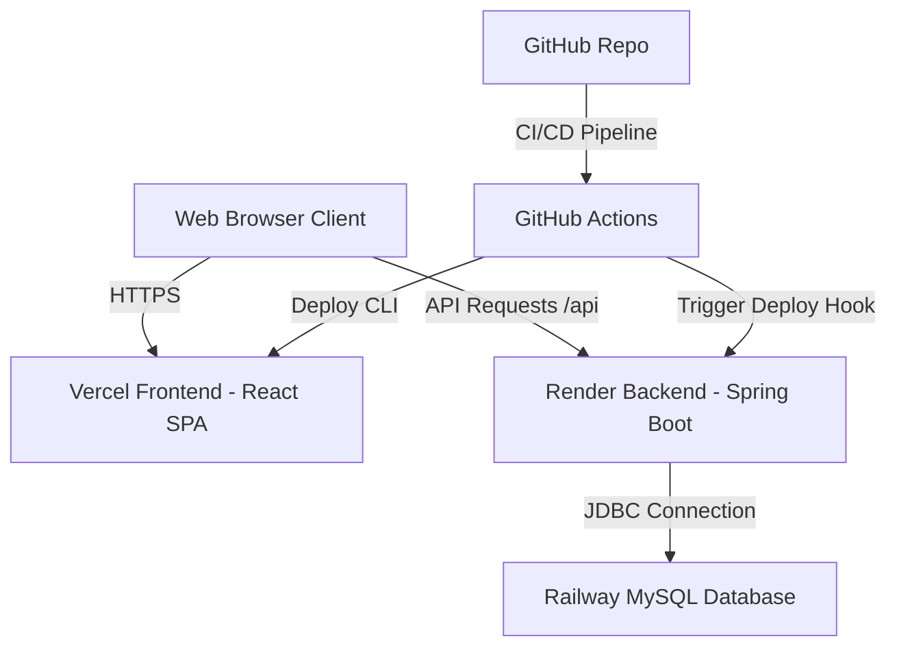

# Employee Management System (EMS) Cloud Deployment Guide

This guide provides step-by-step instructions to deploy the Employee Management System (EMS) application to production using **Railway** (MySQL), **Render** (Backend), and **Vercel** (Frontend).

---

## Architecture Diagram

---

## Phase 1: Database Provisioning (Railway MySQL)

Railway provides a fully managed, instant MySQL instance.

1. **Create Database Service:**
   - Log in to your [Railway Dashboard](https://railway.app/).
   - Click **New Project** -> **Provision MySQL**.
   - Wait for the database container to provision.

2. **Retrieve Connection Parameters:**
   - Click on the newly created **MySQL** card.
   - Navigate to the **Variables** tab or the **Connect** tab.
   - Note down the following values provided by Railway:
     - `MYSQLHOST` (Database Host)
     - `MYSQLPORT` (Database Port, usually `3306`)
     - `MYSQLDATABASE` (Database Name, e.g. `railway`)
     - `MYSQLUSER` (Database Username, e.g. `root`)
     - `MYSQLPASSWORD` (Database Password)
     - `MYSQL_URL` (Full connection URI)

3. **Construct JDBC URL:**
   - Combine the credentials into a standard Spring JDBC Connection string:
     `jdbc:mysql://<MYSQLHOST>:<MYSQLPORT>/<MYSQLDATABASE>?useSSL=false&serverTimezone=UTC&allowPublicKeyRetrieval=true`
     *(Example: `jdbc:mysql://mysql.railway.internal:3306/railway?useSSL=false&serverTimezone=UTC&allowPublicKeyRetrieval=true`)*

---

## Phase 2: Backend Deployment (Render)

Render hosts backend web services directly from GitHub. It reads the dynamic port and executes Java builds.

1. **Create Web Service:**
   - Log in to [Render](https://render.com/).
   - Click **New +** -> **Web Service**.
   - Connect your GitHub repository containing the project.

2. **Configure Service Settings:**
   - **Name:** `employee-management-system-backend`
   - **Environment:** `Docker` (recommended, utilizes the `Dockerfile` at root) OR `Java`
   - *If using native Java environment instead of Docker:*
     - **Build Command:** `mvn clean package -DskipTests`
     - **Start Command:** `java -jar target/employee-management-system-0.0.1-SNAPSHOT.jar`
   - **Instance Type:** `Free` (or higher depending on needs)

3. **Inject Environment Variables:**
   - Go to the **Environment** tab of the service and add:
     | Key | Value | Description |
     | :--- | :--- | :--- |
     | `SPRING_DATASOURCE_URL` | *[Your Constructed Railway JDBC URL]* | Connects backend to Railway MySQL |
     | `SPRING_DATASOURCE_USERNAME` | `<MYSQLUSER>` | Database username from Railway |
     | `SPRING_DATASOURCE_PASSWORD` | `<MYSQLPASSWORD>` | Database password from Railway |
     | `SPRING_SQL_INIT_MODE` | `always` | **Set to `always` on first deployment** to seed tables and roles. Set to `never` after the first successful boot to prevent re-seeding. |
     | `CORS_ALLOWED_ORIGINS` | `https://<your-vercel-app>.vercel.app` | **Note:** Set this to your actual Vercel URL once generated, to prevent CORS blocks. |
     | `JWT_SECRET` | *[Secure 64-character Hex string]* | Base64 or Hex key to sign auth tokens |
     | `JWT_EXPIRATION` | `86400000` | Token validity duration in ms (24 hours) |

4. **Deploy & Retrieve API URL:**
   - Click **Create Web Service** and monitor logs.
   - Once successfully deployed, Render provides a URL at the top left (e.g. `https://employee-management-system.onrender.com`).
   - Append `/api` to it. This is your backend API endpoint: `https://<your-app>.onrender.com/api`.

---

## Phase 3: Frontend Deployment (Vercel)

Vercel is optimized for building and hosting static Vite React applications.

1. **Import Project:**
   - Log in to [Vercel](https://vercel.com/).
   - Click **Add New...** -> **Project**.
   - Import your GitHub repository.

2. **Configure Project Settings:**
   - **Root Directory:** Edit and select `frontend`.
   - **Framework Preset:** Select `Vite` (automatically detected).
   - **Build and Development Settings:**
     - **Build Command:** `npm run build`
     - **Output Directory:** `dist`
     - **Install Command:** `npm install`

3. **Inject Environment Variables:**
   - Under **Environment Variables**, add:
     | Key | Value | Description |
     | :--- | :--- | :--- |
     | `VITE_API_URL` | `https://<your-render-backend-name>.onrender.com/api` | Directs React Axios queries to the backend |

4. **Deploy:**
   - Click **Deploy**. Vercel will build the React assets and host them.
   - Note the production URL (e.g., `https://employee-management-system-frontend.vercel.app`).
   - **Crucial:** Go back to Render backend and update the environment variable `CORS_ALLOWED_ORIGINS` to point to this Vercel domain, to enable network communication.

---

## Phase 4: CI/CD Automation Setup (GitHub Actions)

We configured a GitHub Actions pipeline under `.github/workflows/ci-cd.yml`. To enable automated deployments:

1. **Render Automated Deploy Hook:**
   - Navigate to your Render Service **Settings** tab.
   - Scroll to **Deploy Hook** and copy the unique HTTP URL.
   - In GitHub, go to your repository **Settings** -> **Secrets and variables** -> **Actions**.
   - Create a **New Repository Secret**:
     - **Name:** `RENDER_DEPLOY_HOOK_URL`
     - **Value:** *[Paste the Render deploy hook URL]*

2. **Vercel Automated Deploy CLI (Optional):**
   - Vercel deploys automatically if connected to GitHub. If you want GitHub Actions to handle deployment:
   - In your Vercel Account Settings -> **Tokens**, generate a personal access token.
   - Retrieve Vercel **Org ID** and **Project ID** from `.vercel/project.json` or Vercel dashboard settings.
   - Create the following Repository Secrets in GitHub:
     - `VERCEL_TOKEN`: Vercel Access Token
     - `VERCEL_ORG_ID`: Vercel Account/Organization ID
     - `VERCEL_PROJECT_ID`: Vercel Project ID

---

## Post-Deployment Verification Checklist

- [ ] **Database Connection:** Backend logs in Render output `HikariPool-1 - Start completed.`
- [ ] **Database Seeding:** Access Railway MySQL and verify that the `roles` table is populated with `ROLE_ADMIN`, `ROLE_HR`, `ROLE_MANAGER`, `ROLE_EMPLOYEE`.
- [ ] **First User Creation:** Navigate to Vercel deployment URL, click **Register**, create an Admin account (`roles: ["ROLE_ADMIN"]`), and log in.
- [ ] **Dashboard Loading:** Confirm dashboard cards load the default active stats (all zero initially).
- [ ] **CORS Verification:** In Chrome Developer Tools, verify that API requests are not blocked by CORS preflight checks.
