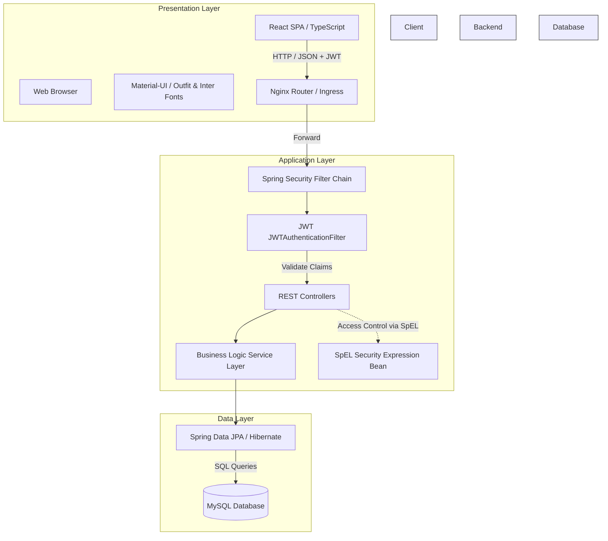
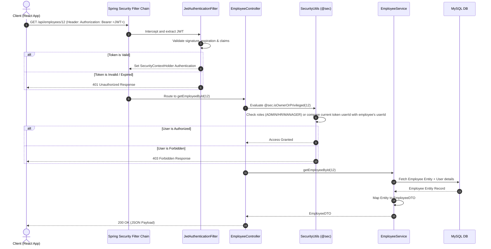
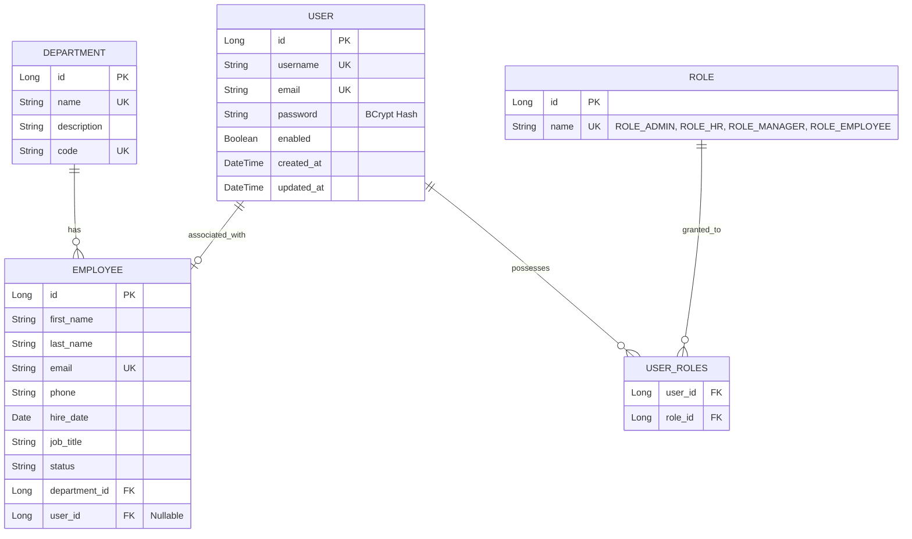

# System Architecture

This document provides a technical overview of the Employee Management System (EMS) architecture, database relationships, and request lifecycle flows.

---

## Architecture Overview

The system is designed following a decoupled, three-tier architecture patterns (Presentation, Application, and Data tiers) packaged as Docker containers.

### Components

1. **Presentation Layer (Frontend)**:
   * Built as a Single Page Application (SPA) using React, TypeScript, and Vite.
   * Styled according to the **Minimalism UI specification** using Material-UI (MUI), prioritizing a clean, typography-focused layout (using Outfit for headers and Inter for body text) with flat containers, no heavy borders, and zero gradients.
   * Manages authentication state client-side using a React Context Provider (`AuthContext`), persisting the JWT in local storage.

2. **Application Layer (Backend)**:
   * Built with Spring Boot (Java 17).
   * Employs **Spring Security** with stateless JWT authentication for securing REST endpoints.
   * Employs method-level security (`@PreAuthorize`) with a custom Spring Bean (`@sec`) evaluating SpEL expressions for fine-grained resource ownership checks.
   * Implements Data Transfer Objects (DTOs) for strict control over request and response formats.

3. **Data Layer (Database)**:
   * Relational database using MySQL.
   * Object-Relational Mapping (ORM) powered by Spring Data JPA and Hibernate.
   * Automated schema migrations mapped via JPA annotations and initialized via SQL seed scripts (`schema.sql`, `data.sql`).

---

## Detailed Request Lifecycle Flow

Below is the request execution sequence for an authenticated API call requesting protected employee data.

---

## Database Model Schema

The entity relationship diagram highlights the database schema links between employees, departments, users, and roles:

### Architectural Key Points
* **One-to-One Linkage**: The `Employee` entity maintains a nullable `@OneToOne` join column to `User`. This decouples standard administrative employee entry from user account activation.
* **Cascades & Deletions**: Deleting a `User` account sets the `user_id` FK on the corresponding `Employee` to null, preserving historical employee records while terminating login capabilities.
* **Role Association**: Roles are managed as a separate table (`role`) linked via a join table (`user_roles`) supporting multi-role configuration, though standard setups assign single primary business roles (`ROLE_ADMIN`, `ROLE_HR`, `ROLE_MANAGER`, `ROLE_EMPLOYEE`).
