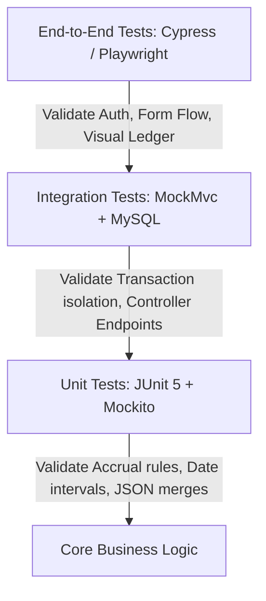
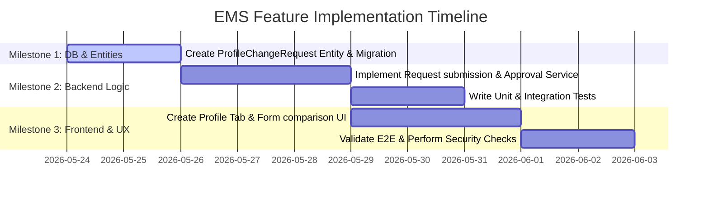

# Product-Focused Engineering Review & Feature Discovery Report

This report presents a thorough analysis of the Employee Management System (EMS) project, highlighting functional gaps in the current implementation, proposing prioritized feature enhancements, and providing engineering blueprints for testing, security, and implementation.

---

## 1. Current State & Gap Analysis

Based on the implemented Spring Boot backend and Glassmorphic SPA frontend, here is the current functional landscape and the primary operational gaps identified:

### Backend Gaps
*   **Static Leave Balances:** Leave balances exist as simple table rows without automated monthly accrual rules, year-end carries, or validation constraints (e.g., tenure-based vacation days).
*   **Hardcoded Payroll Formulas:** Net salary is calculated using hardcoded multipliers (`basic * 0.12` for allowances and `basic * 0.08` for deductions) in [PayrollService.java](file:///a:/My%20project/employee-management-system/src/main/java/com/ems/service/PayrollService.java#L53-L54). There is no support for tax brackets, variable bonuses, unpaid leave deductions, or expense claims.
*   **Simple Check-In/Check-Out:** Attendance lacks scheduling anchors. Without shifts or rosters, calculating "Late" or "Overtime" is arbitrary, as the system does not map check-in times against expected shift start times.
*   **Audit Log Static Triggers:** Audit logs are populated manually via controller/service calls instead of automatic AOP (Aspect-Oriented Programming) interceptors. This leaves room for missing audit logs during schema changes or direct service invocations.

### Frontend Gaps
*   **No Read-Only Dashboard for Employees:** The dashboard page is hidden for regular employees (`ROLE_EMPLOYEE`). When they sign in, they bypass the dashboard entirely and go straight to the employee directory. They should have a personalized dashboard showing their leave balances, check-in status, and latest paystub summaries.
*   **Lack of Bulk File Uploads:** Adding employees must be done one by one. There is no template download or parsing logic to ingest CSV/Excel bulk records.
*   **Hardcoded SPA Routing:** Navigating is done through state updates (`navigateTo('section')`), which does not update the browser URL bar. Users cannot bookmark tabs or use browser "back" buttons without breaking their active session view.

---

## 2. Prioritized Enhancements

| Feature ID | Feature Name | Priority | Rationale |
| :--- | :--- | :--- | :--- |
| **F-01** | Employee Self-Service & Change Request Workflow | **High** | Shifts data maintenance burden from HR to employees while maintaining data integrity via manager approval. |
| **F-02** | Leave Policy Engine & Automated Accruals | **High** | Makes the leave management module operationally viable by automating monthly allocations. |
| **F-03** | Shifts, Rosters & Grace-Period Attendance | **Medium** | Enables correct classification of late arrivals, early departures, and overtime hours. |
| **F-04** | Expense Claims & Reimbursements Integration | **Medium** | Supports dynamic monthly payroll additions (e.g., travel expenses, health benefits) rather than static salary payments. |
| **F-05** | Visual Interactive Org Chart | **Low** | Enhances visual directory browsing but does not impact day-to-day administrative operations. |

---

## 3. Detailed Enhancements Blueprints

---

### [F-01] Employee Self-Service & Profile Change Requests

Employees should be able to update their phone numbers, bank details, and emergency contacts. Changes are staged and sent to HR/Managers for approval before merging into the main `Employee` table.

#### Acceptance Criteria
1.  **ROLE_EMPLOYEE** can view a "My Profile" tab and edit designated fields (Phone, Address, Emergency Contact, Bank Details).
2.  Submitting changes does **not** modify the `Employee` entity directly; it inserts a record into a `ProfileChangeRequest` table with status `PENDING`.
3.  **ROLE_HR** receives a notification and sees a queue of pending profile changes.
4.  HR can `APPROVE` or `REJECT` requests. Approval triggers an atomic write merging the staged fields into the `Employee` record and logs an audit trail.

#### Key UI/UX Considerations
*   **Before/After Comparison View:** HR should see a side-by-side split screen showing the current values and the proposed modifications (highlighting changed values in green/red).
*   **Draft Indicator:** Employees see an alert on their profile saying: *"You have a pending change request submitted on [Date]. Current values will update once approved by HR."*

#### Backend API & Data Model Changes
##### Data Model
```java
@Entity
@Table(name = "profile_change_requests")
public class ProfileChangeRequest {
    @Id @GeneratedValue(strategy = GenerationType.IDENTITY)
    private Long id;
    
    @ManyToOne(fetch = FetchType.LAZY)
    @JoinColumn(name = "employee_id", nullable = false)
    private Employee employee;
    
    private String requestedFieldsJson; // E.g., {"phone":"9998887776", "address":"New York"}
    private String status; // PENDING, APPROVED, REJECTED
    private LocalDateTime submittedAt;
    
    @ManyToOne(fetch = FetchType.LAZY)
    @JoinColumn(name = "processed_by")
    private Employee processedBy;
    private String comments;
}
```
##### API Endpoints
*   `POST /api/employees/self/change-request` (Body: JSON map of fields to change)
*   `GET /api/employees/change-requests?status=PENDING` (HR access only)
*   `POST /api/employees/change-requests/{id}/approve` (HR access only)
*   `POST /api/employees/change-requests/{id}/reject` (Body: `{ "comments": "Reason" }`)

#### Effort Estimation & Risks
*   **Effort:** Medium (4-5 days of development).
*   **Risks:** JSON deserialization security risks (preventing SQL injection via JSON fields or modifications to unauthorized columns like `salary` or `status`).

---

### [F-02] Leave Policy Engine & Automated Accruals

Automate monthly vacation/sick leave credits and support rules like maximum roll-over and tenure multipliers.

#### Acceptance Criteria
1.  System runs a scheduled cron job on the 1st of every month to accrue leave balances for all active employees.
2.  Accrual rate depends on the policy (e.g., Casual: 1.5 days/month, Sick: 1 day/month).
3.  New hires accrue prorated amounts for their first month.
4.  Year-end carryover limit caps the maximum vacation roll-over.

#### Key UI/UX Considerations
*   **Accrual Ledger History:** Inside the "Leave Management" section, employees can click on a balance type to view a ledger timeline showing adjustments: `+1.5 Days (Monthly Accrual)`, `-3.0 Days (Vacation Approved)`.

#### Backend API & Data Model Changes
##### Data Model
```java
@Entity
@Table(name = "leave_policies")
public class LeavePolicy {
    @Id @GeneratedValue(strategy = GenerationType.IDENTITY)
    private Long id;
    private String leaveType; // CASUAL, SICK, EARNED
    private Double annualAllocation;
    private Double monthlyAccrualRate;
    private Double maxCarryOver;
}
```
##### API Endpoints
*   `GET /api/leaves/policies` (List policies)
*   `POST /api/leaves/policies` (Define/Update policies)
*   `GET /api/leaves/balances/ledger/{employeeId}` (Accrual timeline)

#### Effort Estimation & Risks
*   **Effort:** Medium (3-4 days of development).
*   **Risks:** Double-accrual execution. If the cron job triggers twice or fails halfway, it must be idempotent so that rerun attempts do not double-credit balances.

---

### [F-03] Rosters & Shift-Based Attendance Tracking

Compare employee check-ins against designated rosters (e.g., Morning Shift: 09:00 AM - 05:00 PM) to correctly flag late check-ins and compute actual worked hours.

#### Acceptance Criteria
1.  **ROLE_HR** can create shift templates and assign employees weekly schedules.
2.  Attendance records match the `check_in` time against the scheduled shift's start time plus a configurable grace period (e.g., 15 minutes).
3.  Check-ins after the grace period automatically set `status` to `LATE`.
4.  Check-outs before the shift end time set the status to `EARLY_DEPARTURE`.

#### Key UI/UX Considerations
*   **Weekly Calendar Grid:** A weekly shift planner on the HR/Manager view, showing grid blocks for Monday-Sunday. Managers can drag-and-drop shifts to schedule rosters.

#### Backend API & Data Model Changes
##### Data Model
```java
@Entity
@Table(name = "shifts")
public class Shift {
    @Id @GeneratedValue(strategy = GenerationType.IDENTITY)
    private Long id;
    private String name; // Day, Night, Swing
    private LocalTime startTime;
    private LocalTime endTime;
    private Integer gracePeriodMinutes;
}

@Entity
@Table(name = "schedules")
public class Schedule {
    @Id @GeneratedValue(strategy = GenerationType.IDENTITY)
    private Long id;
    @ManyToOne private Employee employee;
    @ManyToOne private Shift shift;
    private LocalDate date;
}
```
##### API Endpoints
*   `POST /api/shifts` (Create Shift template)
*   `POST /api/schedules/assign` (Roster mapping)
*   `GET /api/schedules/my-schedule` (Employee calendar access)

#### Effort Estimation & Risks
*   **Effort:** Large (7-8 days of development).
*   **Risks:** Timezone offsets. If remote employees check in from different timezones, comparing check-in timestamps against local database server times requires strict UTC handling.

---

## 4. Automated Testing Strategy

To validate these enhancements, we recommend a pyramid test strategy.



### Example Test Cases (JUnit 5 & MockMvc)

#### 1. Unit Test: Leave Accrual Computation
```java
@Test
void testAccrualForNewHireProrated() {
    LocalDate hireDate = LocalDate.of(2026, 5, 15);
    LocalDate runDate = LocalDate.of(2026, 6, 1);
    
    // Prorating logic: 16 days employed in May out of 31 days
    double calculatedDays = LeaveAccrualEngine.calculateAccrual(hireDate, runDate, 1.5);
    assertEquals(0.77, calculatedDays, 0.01);
}
```

#### 2. Integration Test: Profile Change Request Approval
```java
@Test
@WithMockUser(roles = "HR")
void approveProfileChangeRequest_ShouldMergeDetails() throws Exception {
    Employee employee = employeeRepository.save(
        Employee.builder().firstName("John").lastName("Doe").email("j.doe@ems.com").status("ACTIVE").build()
    );
    
    ProfileChangeRequest request = requestRepository.save(
        new ProfileChangeRequest(null, employee, "{\"phone\":\"5554443332\"}", "PENDING", LocalDateTime.now(), null, null)
    );

    mockMvc.perform(post("/api/employees/change-requests/" + request.getId() + "/approve")
            .contentType(MediaType.APPLICATION_JSON))
            .andExpect(status().isOk());

    Employee updatedEmployee = employeeRepository.findById(employee.getId()).orElseThrow();
    assertEquals("5554443332", updatedEmployee.getPhone());
    
    ProfileChangeRequest resolvedRequest = requestRepository.findById(request.getId()).orElseThrow();
    assertEquals("APPROVED", resolvedRequest.getStatus());
}
```

---

## 5. Non-Functional Verification Checks

### Security
*   **JSON Sanitization:** Use standard escape utilities (e.g., OWASP HTML Sanitizer or custom Jackon converters) on input JSON mapping in `ProfileChangeRequest` to prevent Cross-Site Scripting (XSS).
*   **Role Validation:** Ensure endpoint security annotations (e.g., `@PreAuthorize("hasRole('HR')")`) guard the approval endpoints to prevent horizontal privilege escalation.

### Performance
*   **Database Indexes:** Add index tags on query columns to optimize lookups:
    *   `idx_schedules_employee_date` on `schedules (employee_id, date)`
    *   `idx_change_requests_status` on `profile_change_requests (status)`
*   **Batching Cron Runs:** When executing monthly leave accruals, chunk database writes (`@Transactional` batch sizes of 100-500) rather than executing single row writes in a loop.

### Observability
*   **Audit Logger integration:** Ensure audit logging triggers automatically inside the approval services using standard Spring AOP Aspect classes intercepting methods annotated with a custom `@Auditable` tag.

---

## 6. Implementation Roadmap & Sequence

Below is the execution plan to implement **F-01** (Profile Change Requests) and **F-02** (Leave Accruals).



---

## 7. Sample GitHub Issue Template (Highest Priority Enhancement: F-01)

```markdown
### Feature Description
Provide self-service dashboard directories to allow regular employees (`ROLE_EMPLOYEE`) to request changes to their profiles (Address, Phone, Emergency Contact, and Bank Details) without administrative credentials. Requests must stage in a queue for HR approval.

### User Stories
* **As an Employee**, I want to submit my new phone number on my profile tab, so that my details are accurate.
* **As an HR Admin**, I want to compare the proposed changes side-by-side with current records, so that I can verify and approve them securely.

### Proposed Technical Design
- Create `ProfileChangeRequest` entity to stage pending records.
- Implement `/api/employees/self/change-request` for submitting requests.
- Guard `/api/employees/change-requests/{id}/approve` with `@PreAuthorize("hasRole('HR')")`.
- Implement a split-panel view on the Frontend comparison drawer.

### Acceptance Criteria
- [ ] Regular employees can submit change requests without editing the database directly.
- [ ] HR Admins see pending counts in the main navigation.
- [ ] HR Admins can click "Approve" to atomically update the Employee record.
- [ ] Approved actions are logged in the `AuditLog` table.

### Out of Scope
- Profile change requests for managers (handled by HR directly).
- Real-time chat on rejection reasons (comments field only).
```

---

## 8. Missing Information Requests

To refine these designs, please let us know:
1.  **Work Location Multi-Tenancy:** Do employees share the same office timezone, or do we need timezone offsets for remote workers?
2.  **Payroll Calculation Components:** What are the specific local tax deductions and allowance components required (e.g. PF, state tax, medical insurance)?
3.  **Leave Carry-over limits:** What are the maximum vacation rollover limits (e.g., maximum 5 carryover days per year)?
