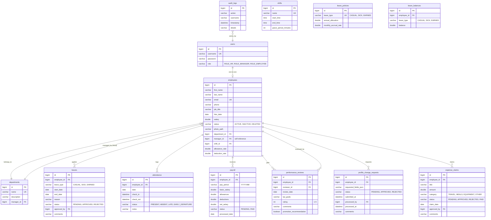

# Implementation Plan - Employee Management System (EMS)

Build a full-featured, secure, and premium Employee Management System using **Spring Boot 3 (Java 17/26)**, **MySQL**, and a responsive **HTML5 + CSS3 + Vanilla JavaScript** frontend.

---

## User Review Required

> [!IMPORTANT]
> **Database Environment:** We verified that XAMPP's MySQL server is installed on your machine under `C:\xampp\mysql`. We successfully started it on port `3306` and created the `ems_db` database. The backend will connect to `jdbc:mysql://localhost:3306/ems_db` using username `root` and an empty password.

> [!TIP]
> **Aesthetic and UX Choices:** We will implement a responsive single-page-app (SPA) feel using Vanilla JS for seamless view switching without full page reloads. The styling features:
> - Sleek Dark/Light theme toggle (stored in LocalStorage)
> - Glassmorphism UI components (translucent cards, backdrop filters)
> - Curated harmonious colors (Deep Royal Navy, Violet accents, emerald success, rose error)
> - Smooth transitions (0.3s ease) and micro-interactions
> - Modern charts using Chart.js

---

## Proposed Architecture & Directory Structure

```
a:\My project\employee-management-system\
├── src/main/java/com/ems/
│   ├── config/             # Spring Security, Web MVC and DataSeeder
│   ├── controller/         # REST API endpoints for all modules
│   ├── dto/                # Request/Response payloads (DTOs)
│   ├── entity/             # JPA Entities mapping to MySQL tables
│   ├── exception/          # Global Exception Handler & custom exceptions
│   ├── repository/         # Spring Data JPA repositories
│   ├── security/           # Custom UserDetails, JWT utility, filters
│   └── service/            # Business logic interfaces and implementations
├── src/main/resources/
│   ├── application.properties
│   └── static/             # Frontend files (no UI frameworks, plain HTML/CSS/JS)
│       ├── index.html      # Authentication / Login / Register / Reset Password
│       ├── dashboard.html  # Core layout (Sidebar, Header, Main content container)
│       ├── css/
│       │   └── style.css   # Modern global design system, themes, and styles
│       ├── js/
│       │   ├── api.js      # Fetch API integration
│       │   ├── auth.js     # Session/JWT storage, login, and access control
│       │   └── app.js      # SPA navigation, charting, notifications, and event handlers
│       └── uploads/        # Directory for uploaded employee photos
```

---

## Database Schema (MySQL)



---

## Proposed Changes & Tasks

### 1. Build Backend Setup
#### [MODIFY] [pom.xml](file:///a:/My%20project/employee-management-system/pom.xml)
- Lower Spring Boot version to standard **3.3.4** (or latest stable Boot 3).
- Add dependencies for Security, JPA, Validation, MySQL Connector, JWT, OpenPDF, and Apache POI.
- Do not use Lombok due to JDK 26 compiler warnings.

#### [MODIFY] [application.properties](file:///a:/My%20project/employee-management-system/src/main/resources/application.properties)
- Configure MySQL Connection details, JPA settings (`hibernate.ddl-auto=update`), multipart upload limits (5MB).

### 2. Entities & Repositories
- Implement JPA Entities for all tables: `User`, `Employee`, `Department`, `Shift`, `Leave`, `LeaveBalance`, `LeavePolicy`, `ExpenseClaim`, `ProfileChangeRequest`, `Payroll`, `PerformanceReview`, `AuditLog`.
- Create corresponding Repository interfaces extending `JpaRepository`. Add custom query methods.

### 3. JWT Security & Auth
- Implement password encryption (`BCryptPasswordEncoder`).
- Custom `UserDetailsService` to fetch user credentials.
- `JwtUtils` to generate and parse JSON Web Tokens.
- `JwtAuthenticationFilter` to validate tokens in incoming requests.
- `SecurityConfig` to configure stateless API session management and RBAC rules.

### 4. Core Services & Controllers
- **AuthService / AuthController**: Login, Forgot password, Reset password.
- **EmployeeService / EmployeeController**: CRUD operations. soft delete by updating status to `DELETED`. Handle photo uploading.
- **DepartmentService / DepartmentController**: CRUD, employee assignments, and lists.
- **LeaveService / LeaveController**: Application, balance tracking, and approval workflow. Integrate dynamic leave policy engine.
- **ShiftService / ShiftController**: Manage work shifts and assign them to employees.
- **AttendanceService / AttendanceController**: Daily check-in/out, late/early flags checked against shift hours and grace periods.
- **PayrollService / PayrollController**: Generate payslips, allowances/deductions (dynamic rates), and integrate approved expense claims as PAID allowances.
- **ExpenseClaimService / ExpenseClaimController**: Submit claims, managers/HR review, and payroll integration.
- **ProfileChangeRequestService / ProfileChangeRequestController**: Employee profile self-service edit request and HR comparison approval workflow.
- **DashboardService / DashboardController**: Compile statistics.
- **AuditLogService / Aspect**: Log administrative and database operations.

### 5. Frontend & UI
#### [NEW] [index.html](file:///a:/My%20project/employee-management-system/src/main/resources/static/index.html)
- Clean, gorgeous glassmorphic login screen (Login, Forgot Password, Reset Password).

#### [NEW] [dashboard.html](file:///a:/My%20project/employee-management-system/src/main/resources/static/dashboard.html)
- Main portal. Features:
  - Sidebar navigation customized by role (HR sees all, Employee sees personal views).
  - Dark Mode Toggle.
  - **Dashboard Summary**: Total employees, Pending leaves, Attendance rate, Monthly payroll totals.
  - Charts (Pie for departments, Line for leaves, Bar for payroll).
  - **Employee Directory**: CRUD directories, shifts, custom rate controls, export Excel/PDF.
  - **My Profile**: View own profile, submit self-service edit requests, track requested updates.
  - **Change Requests**: Comparison panel for HR Admins to approve name/phone updates.
  - **Expenses**: Submit claim modal (Employee) and Pending Expense Approvals queue (Manager/HR).
  - **Leave Manager**: Apply form, history, and Leave Policies Configuration (HR only).
  - **Attendance Tracker**: Visual check-in/out buttons based on shift grace rules.
  - **Payroll Center**: payslips and download PDF payslip with integrated claim details.

#### [NEW] [style.css](file:///a:/My%20project/employee-management-system/src/main/resources/static/css/style.css)
- Premium glassmorphism styling, curated HSL variable variables, dark/light themes, hover states.

#### [NEW] [api.js] & [auth.js] & [app.js]
- Central REST integration, routing navigation, data mapping, and event registrations.

---

## Verification Plan

### Automated Tests
- Run `.\mvnw.cmd test` to execute unit/integration tests for authentication logic and DB interactions.

### Manual Verification
1. Login as employee, submit a profile edit request. Login as admin, approve it, and verify the directory update.
2. Login as HR, edit leave policy accrual, accrue leaves manually, and verify the updated balances.
3. Login as employee, submit an expense claim. Approve as manager, generate payroll as HR, and confirm the claim is reimbursed in payroll and marked PAID.
