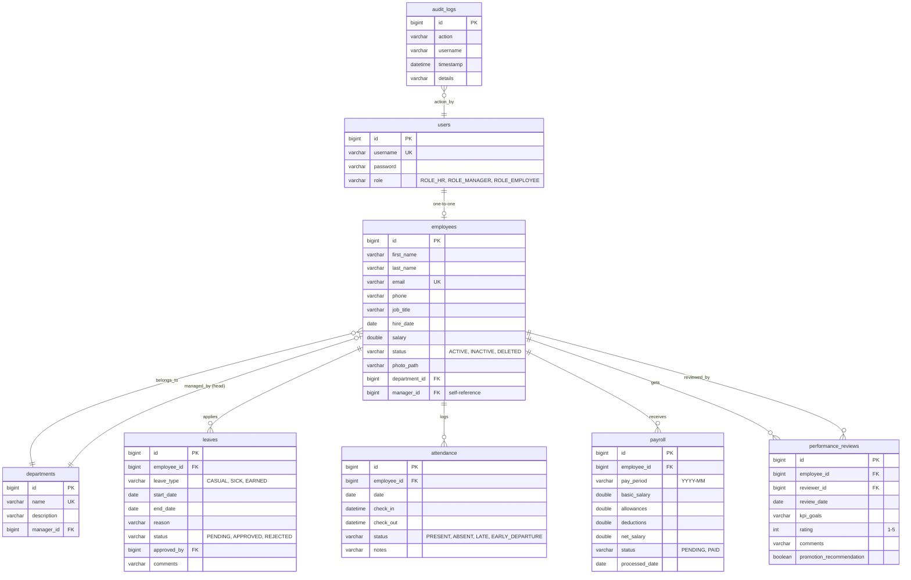

# Implementation Plan - Employee Management System (EMS)

Build a full-featured, secure, and premium Employee Management System using **Spring Boot 3 (Java 17)**, **MySQL**, and a responsive **HTML5 + CSS3 + Vanilla JavaScript** frontend.

---

## User Review Required

> [!IMPORTANT]
> **Database Environment:** We verified that XAMPP's MySQL server is installed on your machine under `C:\xampp\mysql`. We successfully started it on port `3306` and created the `ems_db` database. The backend will connect to `jdbc:mysql://localhost:3306/ems_db` using username `root` and an empty password.
> Let us know if you want to use a different database configuration.

> [!TIP]
> **Aesthetic and UX Choices:** We will implement a responsive single-page-app (SPA) feel using Vanilla JS for seamless view switching without full page reloads. The styling will feature:
> - Sleek Dark/Light theme toggle (stored in LocalStorage)
> - Glassmorphism UI components (translucent cards, backdrop filters)
> - Curated harmonious colors (Deep Royal Navy, Violet accents, emerald success, rose error)
> - Smooth transitions (0.3s ease) and micro-interactions
> - Modern charts using Chart.js

---

## Proposed Architecture & Directory Structure

```
a:\My project\employee-management-system\
├── src/main/java/com/ems/
│   ├── config/             # Spring Security, Web MVC and SSE configs
│   ├── controller/         # REST API endpoints for all modules
│   ├── dto/                # Request/Response payloads (DTOs)
│   ├── entity/             # JPA Entities mapping to MySQL tables
│   ├── exception/          # Global Exception Handler & custom exceptions
│   ├── repository/         # Spring Data JPA repositories
│   ├── security/           # Custom UserDetails, JWT utility, filters
│   └── service/            # Business logic interfaces and implementations
├── src/main/resources/
│   ├── application.properties
│   └── static/             # Frontend files (no UI frameworks, plain HTML/CSS/JS)
│       ├── index.html      # Authentication / Login / Register / Reset Password
│       ├── dashboard.html  # Core layout (Sidebar, Header, Main content container)
│       ├── css/
│       │   └── style.css   # Modern global design system, themes, and styles
│       ├── js/
│       │   ├── api.js      # Fetch API integration
│       │   ├── auth.js     # Session/JWT storage, login, and access control
│       │   └── app.js      # SPA navigation, charting, notifications, and event handlers
│       └── uploads/        # Directory for uploaded employee photos
```

---

## Database Schema (MySQL)



---

## Proposed Changes & Tasks

### 1. Build Backend Setup
#### [MODIFY] [pom.xml](file:///a:/My%20project/employee-management-system/pom.xml)
- Lower Spring Boot version to standard **3.3.4** (or latest stable Boot 3).
- Add dependencies:
  - `spring-boot-starter-data-jpa`
  - `spring-boot-starter-security`
  - `spring-boot-starter-validation`
  - `mysql-connector-j`
  - `lombok` (boilerplate reduction)
  - `io.jsonwebtoken:jjwt-api:0.11.5`, `jjwt-impl:0.11.5`, `jjwt-jackson:0.11.5` (JWT auth)
  - `org.apache.poi:poi-ooxml:5.2.5` (Excel Export)
  - `com.github.librepdf:openpdf:1.3.30` (PDF Export)

#### [MODIFY] [application.properties](file:///a:/My%20project/employee-management-system/src/main/resources/application.properties)
- Configure MySQL Connection details, JPA settings (`hibernate.ddl-auto=update`), multipart upload limits (5MB).

### 2. Entities & Repositories
- Implement JPA Entities for all tables: `User`, `Employee`, `Department`, `Leave`, `Attendance`, `Payroll`, `PerformanceReview`, `AuditLog`.
- Create corresponding Repository interfaces extending `JpaRepository`. Add custom query methods (e.g. search by name/email/department, check active statuses, etc.).

### 3. JWT Security & Auth
- Implement password encryption (`BCryptPasswordEncoder`).
- Custom `UserDetailsService` to fetch user credentials.
- `JwtUtils` to generate and parse JSON Web Tokens.
- `JwtAuthenticationFilter` to validate tokens in incoming requests.
- `SecurityConfig` to configure stateless API session management and RBAC rules (e.g. `/api/employees/**` requires HR/MANAGER role).

### 4. Core Services & Controllers
- **AuthService / AuthController**: Login, Logout (invalidate token/session client-side), Forgot password (generate reset link/code).
- **EmployeeService / EmployeeController**: CRUD operations. Implement soft delete by updating status to `DELETED`. Handle photo uploading to `uploads/` directory. Expose export endpoints.
- **DepartmentService / DepartmentController**: CRUD, employee assignments, and lists.
- **LeaveService / LeaveController**: Application, balance tracking, and approval workflow.
- **AttendanceService / AttendanceController**: Daily check-in/out, late/early flags, and reporting.
- **PayrollService / PayrollController**: Generate payslips, allowances/deductions, process monthly runs.
- **PerformanceService / PerformanceController**: Add KPI tracking, review ratings, promotion flags.
- **DashboardService / DashboardController**: Compile statistics (employee counts, attendance, leaves, payroll sum) to feed UI charts.
- **AuditLogService / Aspect**: Log actions like employee deletion, salary changes, leave approvals.

### 5. Frontend & UI
#### [NEW] [index.html](file:///a:/My%20project/employee-management-system/src/main/resources/static/index.html)
- Clean, gorgeous glassmorphic login screen. Contains options for Login, Forgot Password, and Reset Password. Responsive layout and modern font styling.

#### [NEW] [dashboard.html](file:///a:/My%20project/employee-management-system/src/main/resources/static/dashboard.html)
- Main portal. Features:
  - Sleek sidebar navigation showing modules according to logged-in user role (HR sees all, Employee sees restricted options).
  - Dark Mode Toggle.
  - Notification panel with real-time notifications via SSE (Server-Sent Events) from the backend.
  - Main panel displaying:
    - **Dashboard Summary**: Total employees card, Pending leaves card, Attendance rate card, Monthly payroll totals.
    - Charts (using Chart.js): Department employee distribution (Pie), Monthly Leave Trends (Line), Payroll totals (Bar).
    - **Employee Directory**: Datatable with pagination, sorting, search filters (by name, email, department, position), add/edit modal, delete button, upload-photo button, export Excel/PDF.
    - **Department Manager**: List, add, edit departments, and assign employees.
    - **Leave Manager**: View leave history, apply form, HR/Manager approval table.
    - **Attendance Tracker**: Visual check-in/out buttons, calendar log of presence.
    - **Payroll Center**: List payslips, generate button, pay-period filter, PDF payslip download.
    - **Performance Hub**: Review cards, KPI tracker, rating bars.

#### [NEW] [style.css](file:///a:/My%20project/employee-management-system/src/main/resources/static/css/style.css)
- Premium UI styling:
  - Curated HSL colors (`--primary: 260 85% 60%` - Violet, `--bg-dark: 220 15% 10%`, etc.).
  - Smooth animation keyframes for fade-in, slide-in, and card hovers.
  - Sidebar transitions and glass container styling.

#### [NEW] [api.js](file:///a:/My%20project/employee-management-system/src/main/resources/static/js/api.js) & [auth.js](file:///a:/My%20project/employee-management-system/src/main/resources/static/js/auth.js) & [app.js](file:///a:/My%20project/employee-management-system/src/main/resources/static/js/app.js)
- Modules to handle API requests, token lifecycle, routing (conditional rendering of DOM sections based on hash `#employees`, `#payroll`), and initial data fetches.

---

## Verification Plan

### Automated Tests
- Run `.\mvnw.cmd test` to execute basic unit tests for authentication logic and DB interactions.
- Validate response structures and status codes (e.g. unauthorized requests should return 401/403).

### Manual Verification
1. Open the app in the browser at `http://localhost:8080`.
2. Login with default credentials (HR, Manager, Employee).
3. Test dark mode, photo uploads, Excel/PDF exports, and check-in/check-out.
4. Perform leave approval flow and confirm balance reduction.
5. Review generated payroll records.
